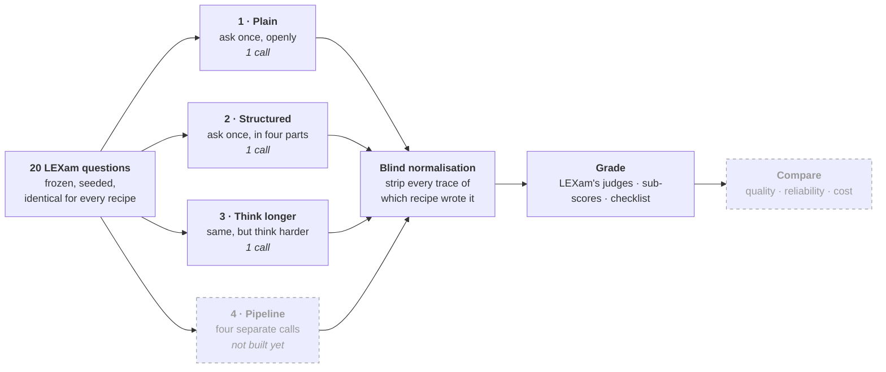
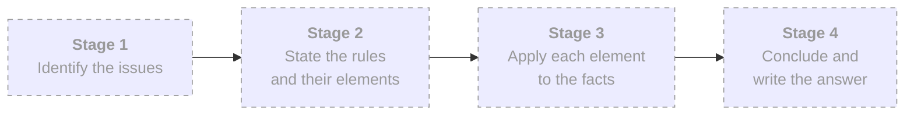

# glassbox

**Does breaking legal reasoning into explicit steps actually make it better?**

Single-pass generation is a black box: when the reasoning fails, you cannot see where.
A staged pipeline is a glass box — every intermediate step is inspectable. This project
is a controlled study of whether that transparency buys any real gain in quality,
reliability, or error recovery, and what it costs.

The design deliberately admits a negative result. If decomposition turns out to add
nothing over a well-written single prompt, that is a finding worth publishing, and the
controls exist to make it interpretable rather than ambiguous.

---

## How the experiment works

The same questions go to every recipe. Only the *way of asking* changes. Answers are
stripped of anything revealing which recipe produced them before any grader sees them.



Recipe 4 is the object of study. Inside it, one question becomes four separate model
calls, each passing a shared case file forward:



**Recipes 2 and 3 are the controls, and they are the reason a result would mean
anything.** Without them, a win for the pipeline has two rival explanations that cannot
be ruled out: *"the gain was just the four-part instructions"* (Recipe 2 gives those in a
single call, for free) and *"the gain was just more compute"* (Recipe 3 spends more than
the pipeline without decomposing anything).

---

## Status

**Phase 1 complete — the measuring instrument is built and calibrated. The experiment
has not been run.**

| | |
|---|---|
| ✅ Question selection, frozen and reproducible | 20 questions, seeded, with provenance |
| ✅ Answer generation, metered and resumable | 3 of 4 recipes, 60 real answers |
| ✅ Grading — three layers, blind to condition | validated against a calibration gate |
| ❌ **Recipe 4, the pipeline** | **the thing being studied** |
| ❌ Reliability runs, fault injection, analysis | Phase 3 |

138 tests, none of which call a model.

Everything Phase 1 measured — including several findings that contradicted the original
design — is written up in **[`docs/phase1-outcomes.md`](docs/phase1-outcomes.md)**.

---

## What Phase 1 already found

Building the grader before the pipeline was a deliberate choice, and it paid for itself:

- **The official LEXam grader saturates.** It scored the model 0.85 and the *experts' own
  answers* 0.89, with 19 of 20 answers landing on just two values. It cannot separate good
  from excellent, so the point-level checklist — which produced 18 distinct values across
  20 answers — carries the study instead.
- **One LEXam question has the wrong answer attached.** `0f6dd9e7` asks about Art. 101
  TFEU; its reference answer analyses Art. 102 and a different fact pattern. Replaced, and
  recorded in the manifest.
- **Temperature is silently ignored** by `gpt-5-mini` — passing it does not error. Stability
  is therefore measured under the model's default sampling, and the write up must say so.
- **The blinding was leaking.** The formatting stripper missed the em dash the model
  actually writes, so 15 of 20 Recipe 3 answers were reaching the grader still wearing
  their step headings. Fixed; now zero across all 60.

### Cost of the three built recipes

| Recipe | Tokens | Cost |
|---|---|---|
| 1 · Plain | 69,686 | $0.12 |
| 2 · Structured | 129,270 | $0.23 |
| 3 · Think longer | 439,382 | $0.85 |

Recipe 3 spends **3.4×** Recipe 2 on an identical prompt — almost entirely in hidden
reasoning rather than longer answers, so answer length does not become a confound.

---

## Repository layout

| Path | What |
|---|---|
| [`src/glassbox/recipes/`](src/glassbox/recipes/) | The recipes and their prompts — the experiment itself |
| [`src/glassbox/grading/`](src/glassbox/grading/) | Blinding, LEXam's judges, checklist scoring |
| [`src/glassbox/`](src/glassbox/) | Model client, cost metering, dataset, storage, runner |
| [`scripts/`](scripts/) | The commands you actually run |
| [`tests/`](tests/) | 138 offline checks |
| [`docs/`](docs/) | Design spec, implementation plan, Phase 1 outcomes |

Question text, checklists and generated answers stay out of version control — LEXam's
content is not redistributed here. Only question IDs and metadata are committed.

## Running it

```bash
uv venv && uv pip install -e ".[dev]"
cp .env.example .env          # add your OpenRouter key

python scripts/select_questions.py --split dev --n 20 --seed 20260810 --name dev_20
python scripts/calibrate.py                       # prove the grader works first
python scripts/run_recipe.py --recipe plain --questions dev_20
python scripts/grade_runs.py --run-dir dev_20__plain --questions dev_20
```

Every long-running script is resumable: a killed run picks up where it stopped rather
than re-spending.

---

## Data and models

- **Dataset** — [LEXam](https://lexam-benchmark.github.io/), English open questions, filtered
  to those requiring applied legal reasoning
- **System model** — `openai/gpt-5-mini`, the same model for every recipe and every stage,
  so the manipulation is structure rather than capability
- **Graders** — LEXam's published three-judge ensemble (`gpt-4o`, `deepseek-chat`,
  `qwen3-32b`), scored as the minimum
- **Provider** — all calls via OpenRouter

## Related work

Independent of, but following on from, `prompt2GDPR-v2` (an agentic GDPR Article 5(1)(b)
compliance pipeline) and an earlier master's thesis on single-prompt GDPR Article 5
assessment. No shared code.
